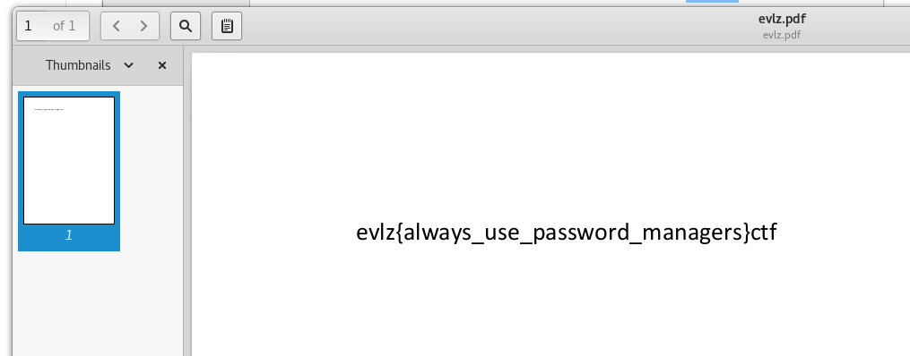

### Yahoo

A password protected PDF file.   

From the name I thought it might be a password from the yahoo dump but that dictionary failed to crack it.

Cracked using pdfcrack and the rockyou dict.

```

➜  Downloads pdfcrack evlz.pdf -w /usr/share/seclists/Passwords/rockyou.txt

PDF version 1.7
Security Handler: Standard
V: 2
R: 3
P: -1060
Length: 128
Encrypted Metadata: True
FileID: 34385325fabaa647b32f9bc7ef43f1cd
U: 7a037e94d573b8ac4d42365969743bc500000000000000000000000000000000
O: 2ba5b708f15bd65d68b332348b453bbbe0c418e7eef048ae7a01516a387765e8
Average Speed: 38524.4 w/s. Current Word: 'tigger?'
.....
found user-password: '*yellowtulip*'
```
The password allows the pdf to be opened displaying the flag



